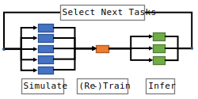

# ML-In-The-Loop Workflow for Molecular Design with Parsl

This example demonstrates a simple molecular design application combining simulations with machine learning (ML) training and inference. The objective is to efficiently identify molecules with the largest ionization energies from a large dataset of potential candidates. 

The example was adapted from an [ExaWorks demo](https://github.com/ExaWorks/molecular-design-parsl-demo/tree/main) developed by Logan Ward, ANL.

The ionization energy (IE) of a molecule is the amount of energy required to remove one electron from the molecule in its ground state to produce a posotovely charges ion. 
IE can be computed using various simulation packages (here we use [xTB](https://xtb-docs.readthedocs.io/en/latest/contents.html)); however, execution of these simulations can be expensive, and thus, given a finite compute budget and a large set of molecules to screen, we must carefully select which molecules to explore by simulation. 
To help reduce the cost of screening, we use machine learning, specifically a k-nearest neighbors (KNN) regressor, to predict the IE of molecules based on previously simulated data. 
We then employ an iterative process often called [active learning](https://pubs.acs.org/doi/abs/10.1021/acs.chemmater.0c00768), to simulate the best identified compounds and retrain the KNN model to improve the accuracy of predictions. 

For this example, we use [Parsl](https://github.com/Parsl/parsl) to execute functions (simulation, model training, and inference) in parallel. Parsl allows us to establish dependencies in the workflow and to execute the workflow on arbitrary computing infrastructure, from laptops to supercomputers. We show how Parsl's integration with Python's native concurrency library (i.e., [`concurrent.futures`](https://docs.python.org/3/library/concurrent.futures.html#module-concurrent.futures)) let you write applications that dynamically respond to the completion of asynchronous tasks.

The resulting ML-in-the-loop workflow proceeds as follows.

